# 10分钟AI高质量数据分析_可编辑版

- Source: `10分钟AI高质量数据分析_可编辑版.pptx`
- Total slides: 13

## Slide 1

10 分钟用 AI 完成高质量数据分析

从数据源收集到 Excel Agent 分析，再到图表与报告输出

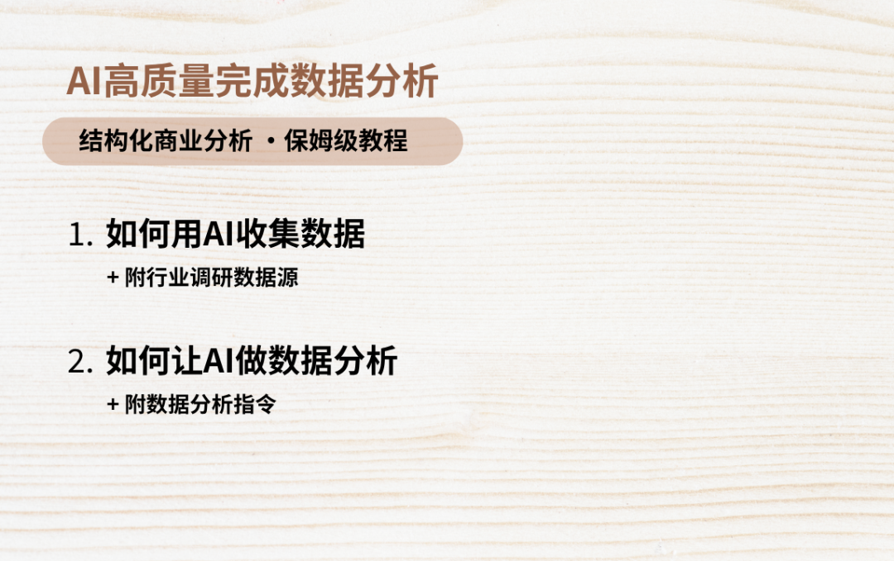

数据源

DIG 框架

可交付

行业研究从高质量数据开始

描述、挖掘、结论三步推进

表格、图表、报告可继续编辑

### Speaker Notes

- [Sources]
- - 微信文章：https://mp.weixin.qq.com/s/F0RQ2BdpnyVpFY11lFnGqA
- - 文章配图：img_02.png

## Slide 2

AI DATA ANALYSIS

痛点：传统数据分析耗时，AI 把流程压缩成对话任务

四处搜罗数据、清洗表格、嵌套公式、绘制图表，常常耗掉大半天。

过去

一句话讲清需求，AI Agent 可收集数据、整理 Excel、生成报告。

现在

不是让 AI 替你“想当然”，而是用清晰框架约束它分析。

关键

文章给出的两个场景：先用 AI 收集高质量数据，再用 AI 解读数据并产出报告。

### Speaker Notes

- [Sources]
- - 微信文章：https://mp.weixin.qq.com/s/F0RQ2BdpnyVpFY11lFnGqA

## Slide 3

AI DATA ANALYSIS

场景一：让 AI 先把分散资料整理成结构化 Excel

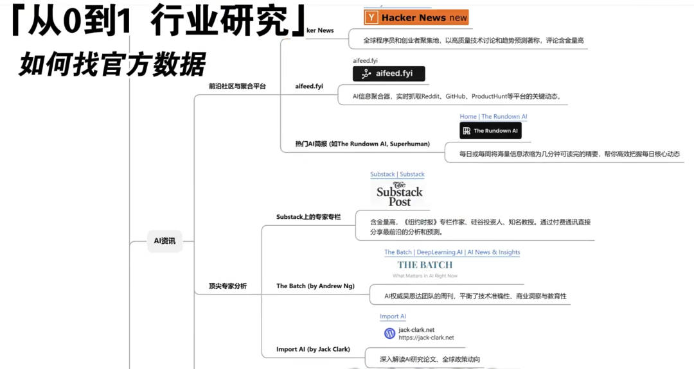

可直接给 Agent 的需求

我要做新能源汽车市场调研，想知道 2024-2026 年行情、主要品牌销量、渗透率、上下游供应链情况，并汇总成 Excel 表格。

- • 自动抓取公开报告和数据
- • 按品牌分类整理销量
- • 同比、环比、渗透率、出口数据进入子表

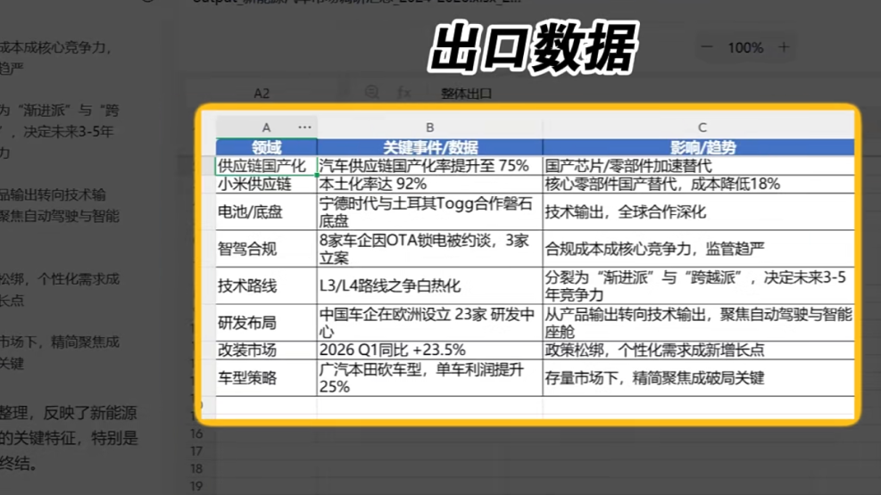

### Speaker Notes

- [Sources]
- - 微信文章：https://mp.weixin.qq.com/s/F0RQ2BdpnyVpFY11lFnGqA
- - 文章配图：img_03.png
- - 文章配图：img_06.png

## Slide 4

AI DATA ANALYSIS

数据源意识：AI 很强，但输入渠道决定上限

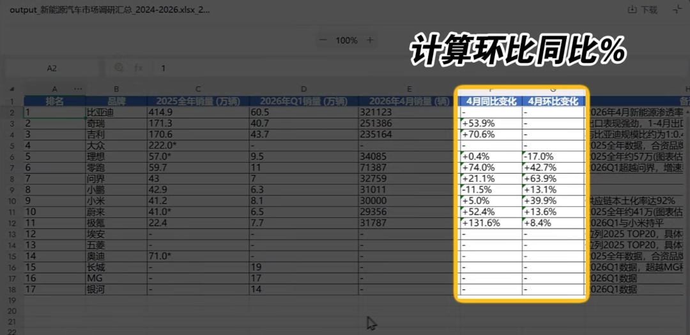

行业研究

官方统计、行业协会、研究报告

市场表现

销量、渗透率、出口、品牌份额

供应链

上游材料、核心零部件、下游应用

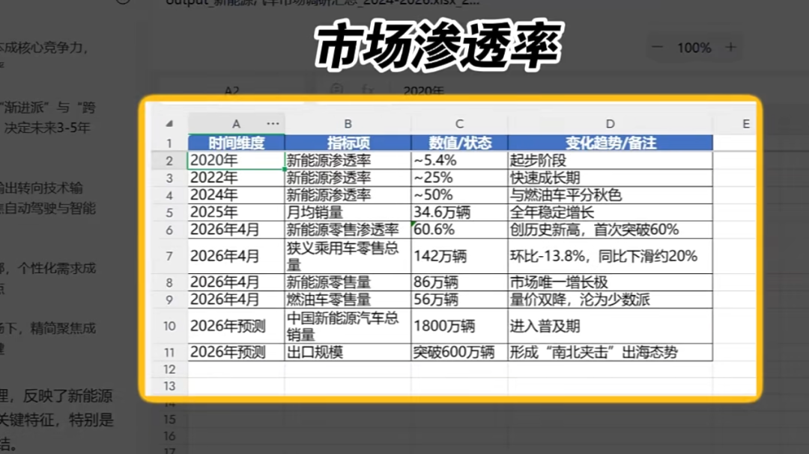

交付格式

Excel 主表 + 子表 + 字段说明

### Speaker Notes

- [Sources]
- - 微信文章：https://mp.weixin.qq.com/s/F0RQ2BdpnyVpFY11lFnGqA
- - 文章配图：img_04.png
- - 文章配图：img_05.png

## Slide 5

AI DATA ANALYSIS

场景二：用 DIG 框架约束 AI 做分析

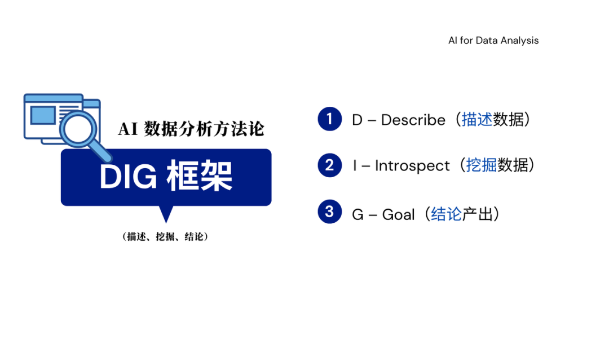

Describe｜描述数据

D

梳理字段、类型、缺失值、唯一值、均值和重要分布。

Inspect｜挖掘数据

I

提出疑问、发现异常、标记需要更多信息验证的假设。

这套框架的作用，是让 AI 先理解数据，再发现问题，最后围绕业务目标输出结论。

Goal｜给出产出

G

围绕目标形成 why / what / how 的分析报告。

### Speaker Notes

- [Sources]
- - 微信文章：https://mp.weixin.qq.com/s/F0RQ2BdpnyVpFY11lFnGqA
- - 文章配图：img_08.png

## Slide 6

AI DATA ANALYSIS

步骤 1：先让 AI 描述数据，校验理解是否正确

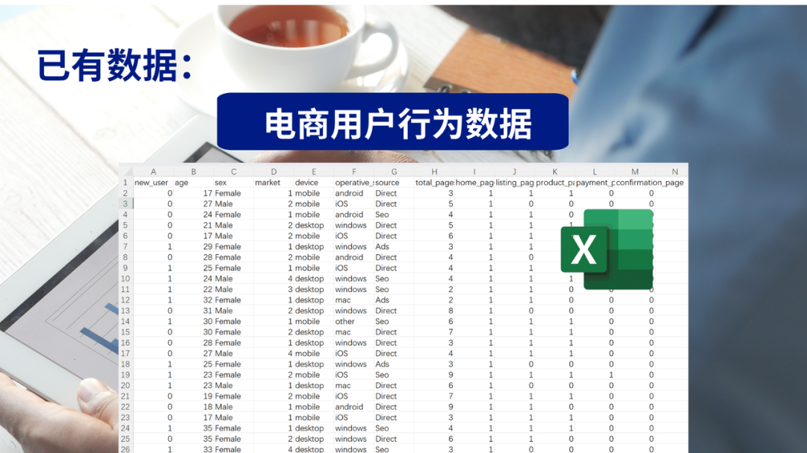

推荐 Prompt

对数据进行描述，针对所有字段、类型、缺失/唯一值、平均值、重要分布信息做初步梳理，并指出值得进一步分析的字段和理由；随机给 2-3 个 sample，让我确认你理解了数据。

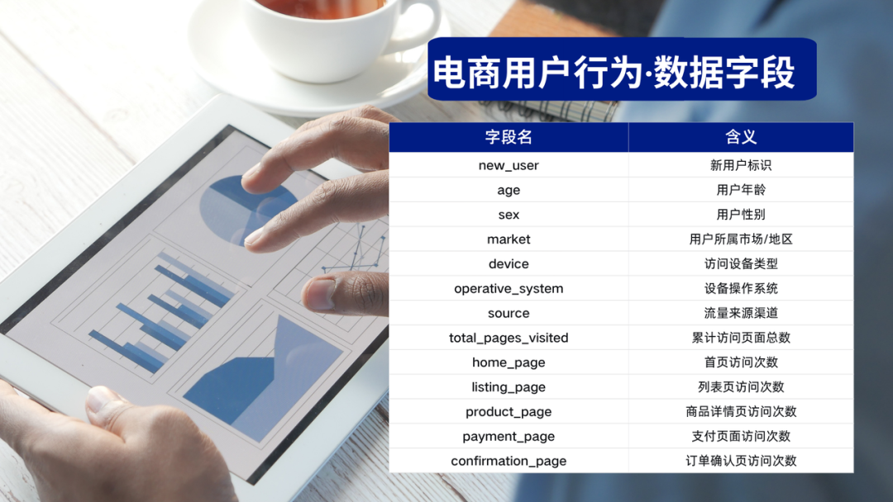

- • 示例中 AI 识别出 1000 行、13 个字段
- • 女性用户占比高、移动端渠道占比高等初步洞察浮现
- • 这一步能避免后续分析建立在错误字段理解上

### Speaker Notes

- [Sources]
- - 微信文章：https://mp.weixin.qq.com/s/F0RQ2BdpnyVpFY11lFnGqA
- - 文章配图：img_09.png
- - 文章配图：img_10.png

## Slide 7

AI DATA ANALYSIS

字段分析：从分布里找到第一批业务线索

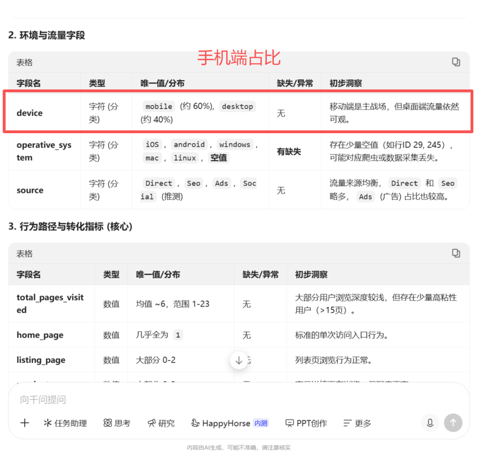

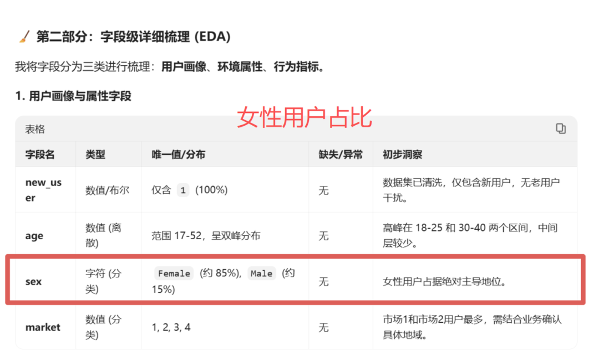

用户画像

示例中女性群体占据主要客群。

客户来源：移动端渠道是主要获客来源。

### Speaker Notes

- [Sources]
- - 微信文章：https://mp.weixin.qq.com/s/F0RQ2BdpnyVpFY11lFnGqA
- - 文章配图：img_13.png
- - 文章配图：img_14.png

## Slide 8

AI DATA ANALYSIS

步骤 2：让 AI 主动提问，发现被忽略的异常

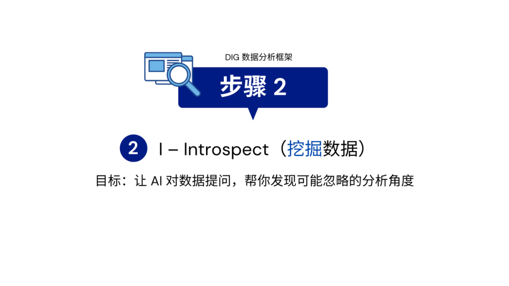

推荐 Prompt

提出你对这些数据的疑问，并说明哪些假设当前无法确认，需要更多信息支持。

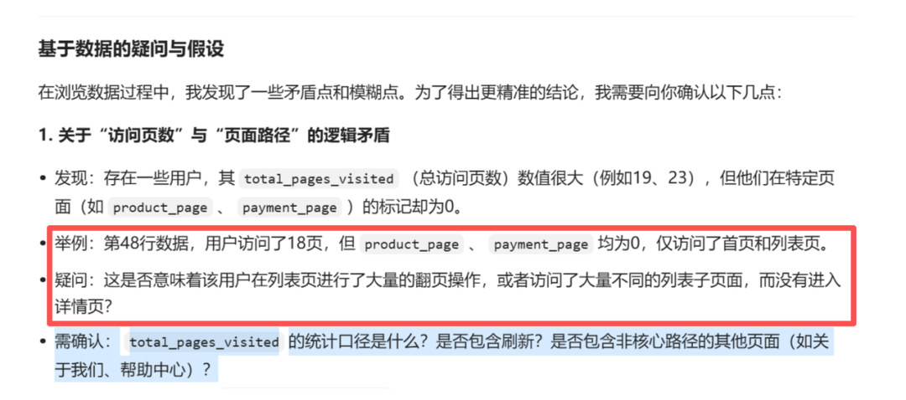

示例异常

某用户访问 18 页，但只停留在首页和商品列表页，没有进入商品详情页。它可能意味着商品吸引力不足，也可能是统计路径有问题。

### Speaker Notes

- [Sources]
- - 微信文章：https://mp.weixin.qq.com/s/F0RQ2BdpnyVpFY11lFnGqA
- - 文章配图：img_17.png
- - 文章配图：img_18.png

## Slide 9

AI DATA ANALYSIS

步骤 3：明确最终目标，让 AI 输出报告结构

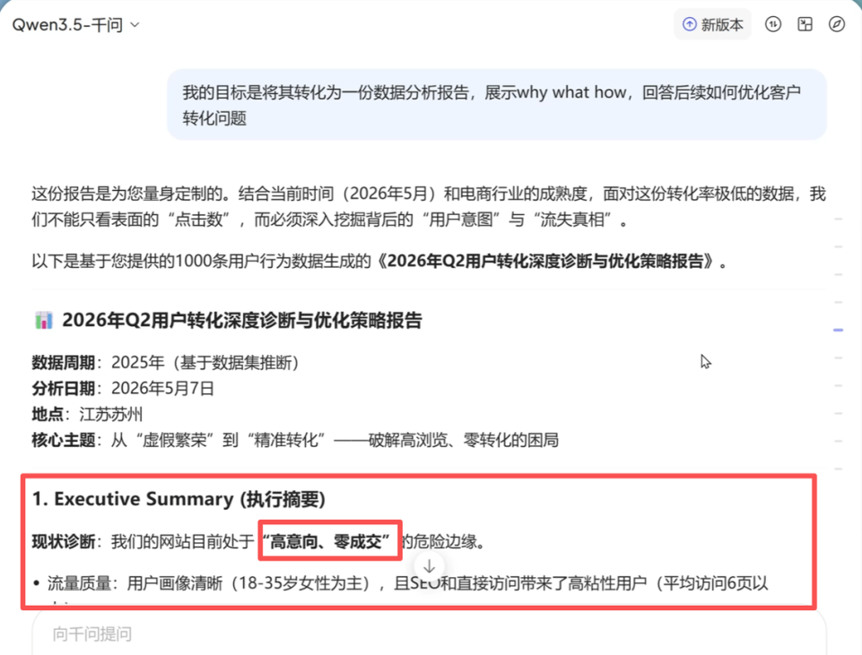

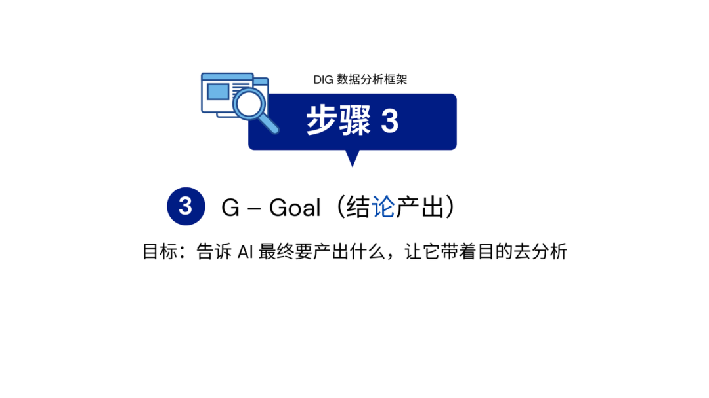

目标表达

将其转化为一份数据分析报告，展示 why / what / how，回答后续如何优化客户转化问题。

AI 输出的报告将“高意向、低成交”作为痛点，并继续拆解原因、漏斗和优化动作。

### Speaker Notes

- [Sources]
- - 微信文章：https://mp.weixin.qq.com/s/F0RQ2BdpnyVpFY11lFnGqA
- - 文章配图：img_20.png
- - 文章配图：img_21.png

## Slide 10

AI DATA ANALYSIS

报告逻辑：用 Why / What / How 把洞察讲完整

Why

What

How

为什么流失

哪里流失

怎么优化

罗列数据并做归因，解释高意向用户为何没有成交。

用漏斗模型拆开关键环节，定位转化断点。

提出三步走建议，形成可执行的提升路径。

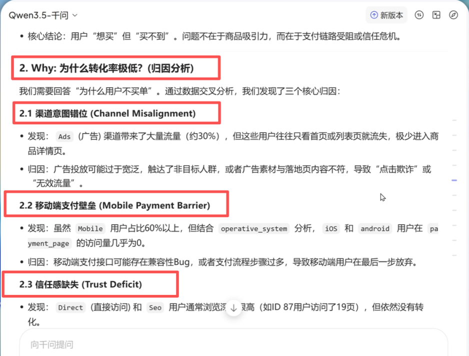

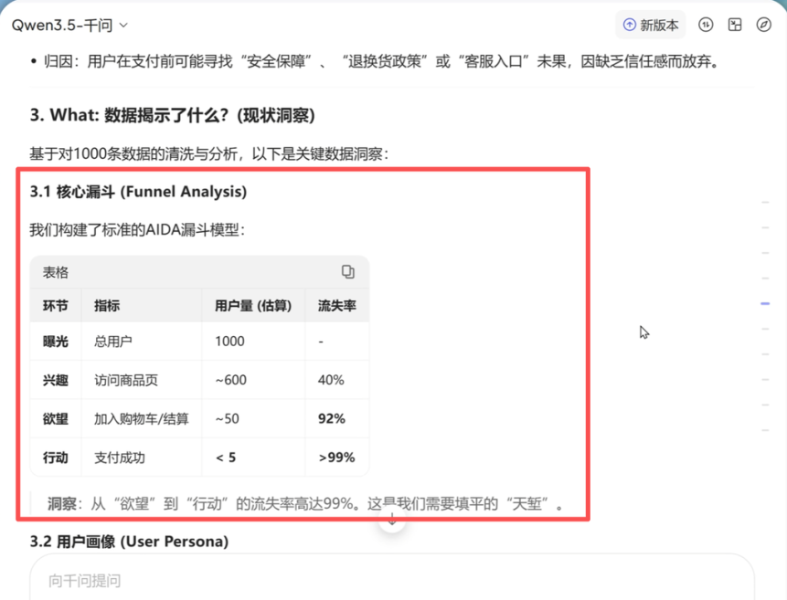

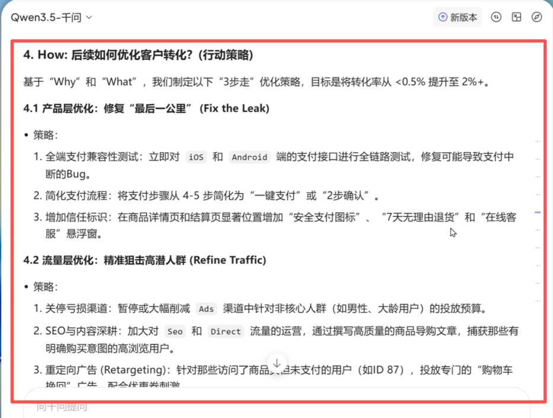

### Speaker Notes

- [Sources]
- - 微信文章：https://mp.weixin.qq.com/s/F0RQ2BdpnyVpFY11lFnGqA
- - 文章配图：img_22.png
- - 文章配图：img_23.png
- - 文章配图：img_24.png

## Slide 11

AI DATA ANALYSIS

最终交付：图表、透视表和报告都能下载编辑

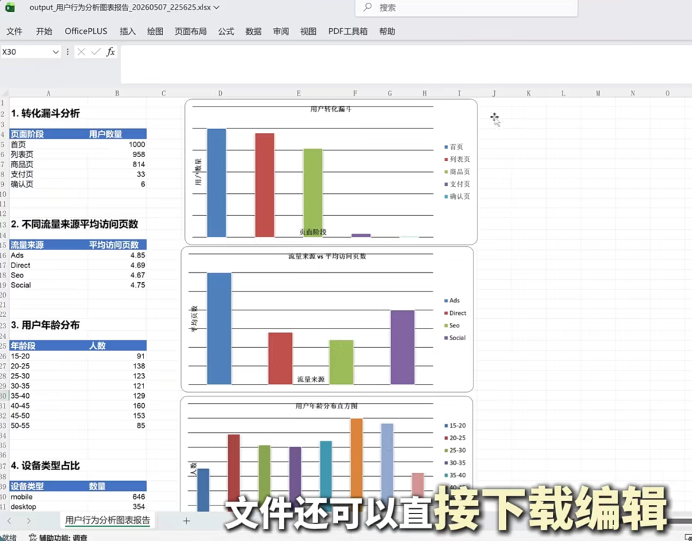

AI 生成内容不止是一段文字

- • 转化漏斗可视化
- • 流量来源图表
- • 数据透视表
- • 可下载、可编辑的 Excel 文件
- • 稍加微调即可进入工作汇报

目标是把分析过程沉淀成可复用的工作产物。

### Speaker Notes

- [Sources]
- - 微信文章：https://mp.weixin.qq.com/s/F0RQ2BdpnyVpFY11lFnGqA
- - 文章配图：img_25.png

## Slide 12

AI DATA ANALYSIS

可复用流程：从资料到洞察，只保留五个动作

找

说

验

挖

交

定位可靠数据源

把需求讲成可执行任务

让 AI 描述数据并校验理解

要求 AI 提问、找异常、补假设

指定报告目标和可编辑文件格式

这五步能把 AI 从“帮我看看数据”升级为“按业务目标完成数据分析交付”。

### Speaker Notes

- [Sources]
- - 微信文章：https://mp.weixin.qq.com/s/F0RQ2BdpnyVpFY11lFnGqA

## Slide 13

结论

AI 降低了数据分析门槛，但高质量结果仍来自清晰的数据源、分析框架和交付目标。

数据源

框架

交付

先找到可靠渠道，再让 AI 汇总整理。

用 Describe / Inspect / Goal 约束分析。

明确要 Excel、图表还是汇报报告。

下一步：拿一份真实业务数据，按五步流程跑一次完整交付。

### Speaker Notes

- [Sources]
- - 微信文章：https://mp.weixin.qq.com/s/F0RQ2BdpnyVpFY11lFnGqA
