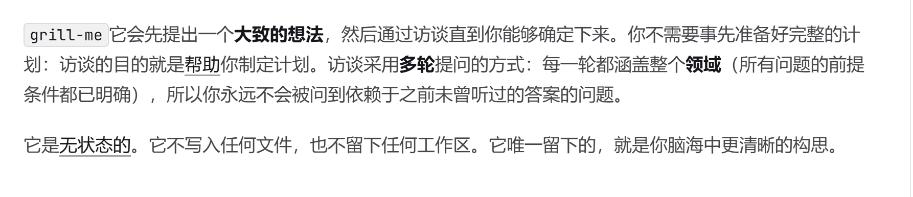
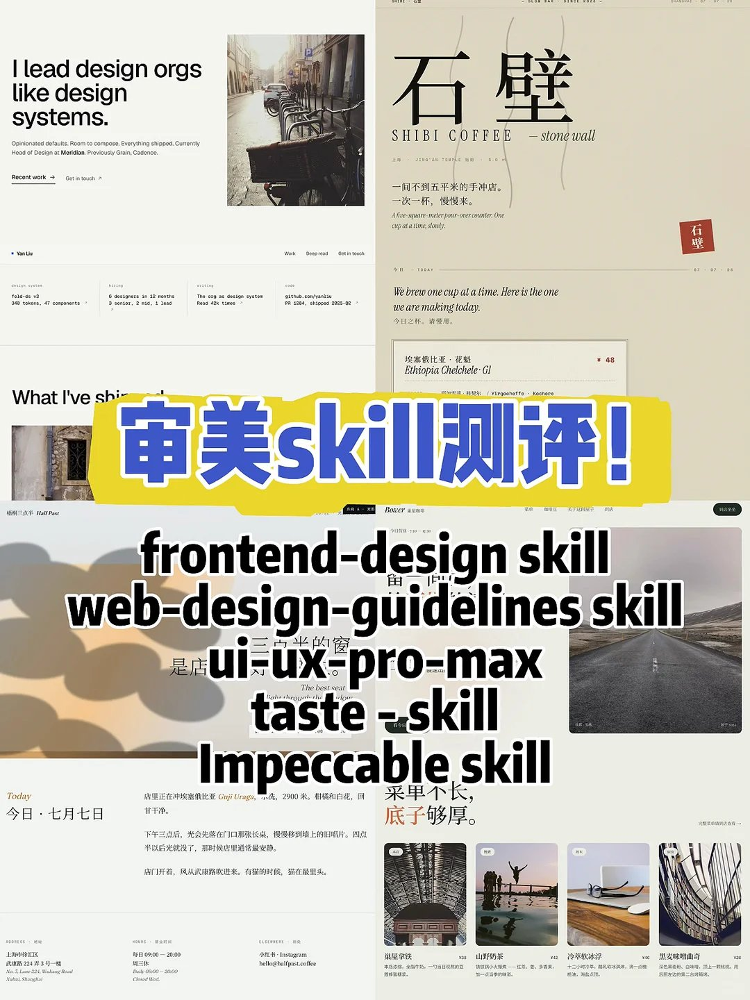
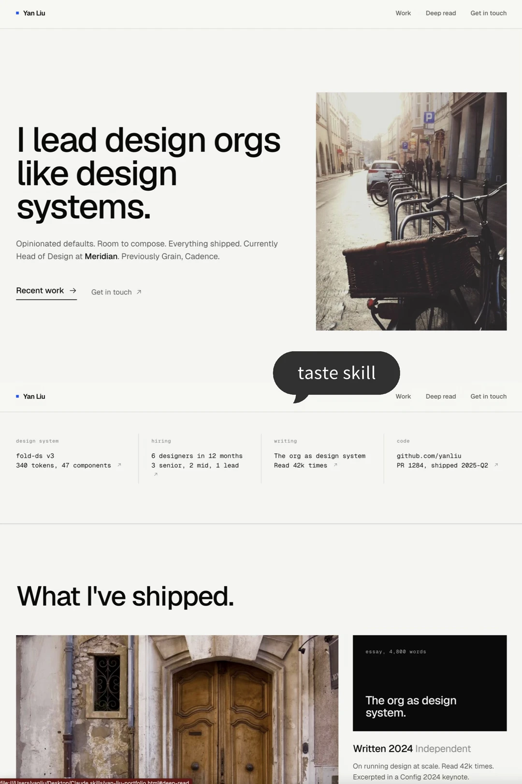
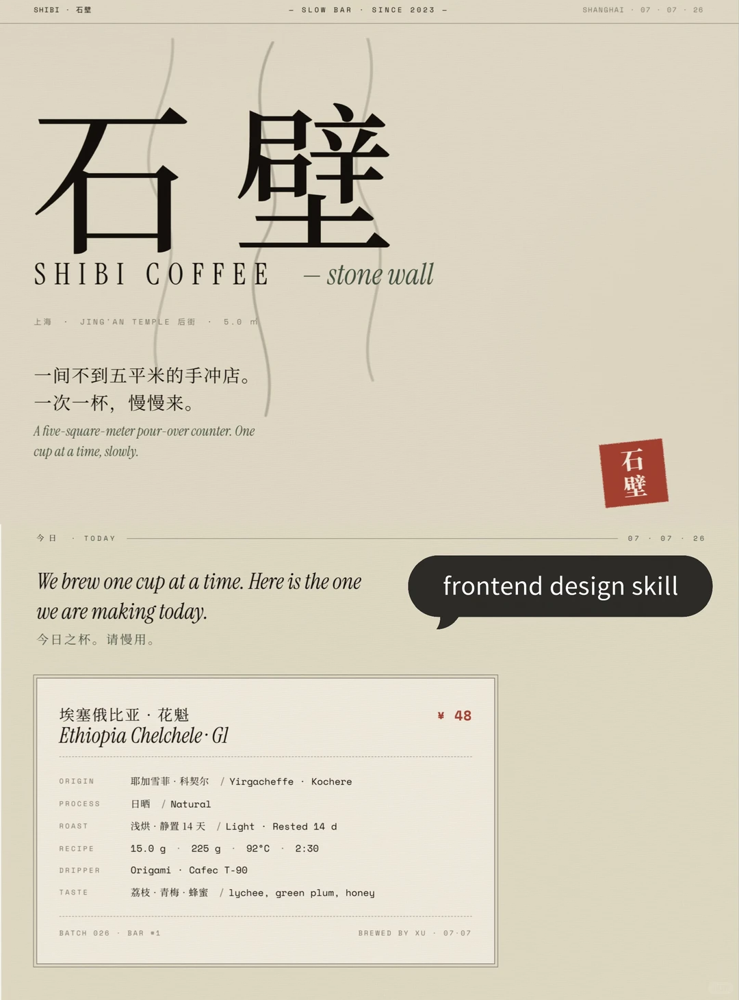

# 工作台制作复盘

- Source: `工作台制作复盘.pptx`
- Total slides: 13

## Slide 1

AI WORKBENCH

从零做一个数据分析工作台

一条 AI 协作流水线 · 让学生看懂「怎么用 AI 做工具」

单文件 HTML · 双击即开 · 数据不出浏览器

## Slide 2

- 为什么是「工作台」，不是「单次任务」？
- 可复用，是工具与一次性请求的本质区别

单次任务

工作台

- · 每次把数据 + 需求喂给 AI
- · 现算现出，结果不沉淀
- · 下次换数据，重头再来
- · 口径可能每次不一样

- · 需求 / 方法 / 口径一次固化
- · 上传数据 → 点一下 → 出报告
- · 随取随用，永久复用
- · 双引擎 + QA，结果可验证

单次是「求 AI 帮一次忙」，工作台是「把 AI 的能力装进一个随取随用的工具」

## Slide 3

- 全流程总览：六步流水线
- 「工作台搭建师」专家贯穿全程

1

2

3

让 AI 读懂需求

召唤「工作台搭建师」

设计对齐

喂课程 PPT

Expert

grill-me

4

5

6

画界面

搭 UI + 填功能

质量保障

frontend-design

Codex CLI

karpathy / superpower

专家管「怎么想」，技能管「会不会做」——一个专家贯穿，五把技能按环节换

## Slide 4

- 第一步 · 让 AI 读懂需求
- 需求不是凭空提，是从课程材料里「喂」出来的

课程 PPT

AI 总结

表述需求

→

→

《统计与数据分析基础》

提炼实训与统计口径

我要做一个数据分析工作台

- 要点：先把课程材料交给 AI 让它「读懂」，再用一句话把需求说清楚。
- 先总结、再定义——避免一上来就让它瞎猜。

## Slide 5

- 第二步 · 召唤「工作台搭建师」专家
- 全程以搭建者的身份和视角推进

Expert 专家

Skill 技能

- 管「怎么想」
- 定义身份、角色和思维方式
- 同一时间只认一个

- 管「会不会做」
- 装进新能力，按需开关
- 可以同时挂好几个

- 最佳搭配 = 专家 + 技能
- 开「工作台搭建师」定方向，再按环节挂 grill-me / frontend-design 等技能

## Slide 6

- 第三步 · 设计对齐
- 用 grill-me 把需求颗粒度问清楚

逐层追问，把模糊需求问成清晰计划

功能

没有它，AI 只能瞎猜你的真实意图

为什么

口径没人追问 → 双引擎对不上，改两遍

不用会怎样

▲ grill-me：访谈式提问，帮你把构思变清晰

## Slide 7

- 第四步 · 画界面，为什么要用设计 skill？
- 通用 AI 出「能跑但丑」，设计 skill 出「有审美」

通用 AI 直接写

- 结论
- 5 个审美 skill 实测，
- 这套工作台选
- frontend-design

- 烂大街渐变、AI 味重
- 能跑，但没法直接投影

设计 skill 来画

- 有自己的审美、极简细节控
- 生成 HTML，对话即可微调

▲ 5 个审美 skill 测评

## Slide 8

- 第四步 · 5 个审美 skill 实机对比
- 同一套设计 prompt，不同 skill 出的页面

taste-skill

UI-UX-PRO-MAX

frontend-design

英文极简 portfolio，做中文教学工具水土不服

中文能打，但实测略有 AI 味

中文质感最好，极简细节控，胜出

对「中文 + 教学投影」场景，frontend-design 最合——三张实机 + 博主实测得出

## Slide 9

- 第五步 · 搭 UI + 填功能
- 先骨架、再微调、后填血肉

搭骨架

微调

填血肉

→

→

把三栏界面结构搭出来

Codex CLI 里顺手调细节

让 AI 填 12 项分析能力

- 要点：界面先有「形」，AI 才知道往哪填功能。
- Codex CLI 让「边聊边改代码」成为可能，微调不再靠手敲。

## Slide 10

- 第六步 · 工程质量保障
- 用技能守住质量，不靠肉眼

karpathy / superpower 把工程质量程序化

功能

- 冒烟测试
- 61 项
- QA 三层校验
- 78 项全绿

AI 也会犯错，得有「验证」兜底

为什么

众数取最小、指数自洽这种边界 bug 没人抓

不用会怎样

## Slide 11

- 成果 · 12 项分析能力
- 10 个课堂实训全跑通，78 项 QA 全绿

描述统计

多指标对比

数据清洗

抽样估计

统计指数

相关回归

时间序列

分组汇总

t 检验

方差分析

卡方检验

非参数检验

描述 + 推断统计全覆盖 · 双引擎口径一致 · 数据不满足条件会明确提示而非伪造

## Slide 12

做工具 = 选对专家 + 挂对技能 + 阶段验收

而不是「一键生成」

- 清晰的需求 + 趁手的技能 + 每一步都验证
- ——这才是用 AI 做出可用工具的正确姿势

## Slide 13

- 附录 · 术语表
- 正文用到的词，这里都有解释

Expert 专家

管「怎么想」：定身份、角色和视角，一次只认一个

Skill 技能

管「会不会做」：装进新能力，可同时挂多个、按需开关

grill-me

访谈式追问，把模糊需求问成清晰可执行的计划

frontend-design

有审美的网页生成技能，出 HTML、响应式、可对话微调

Codex CLI

命令行 AI 编码工具，边聊边改代码、顺手微调

karpathy / superpower

把工程质量（代码质量、测试验收）程序化的技能

双引擎

浏览器 JS 现场算 + Python 当基准验算，口径必须一致
